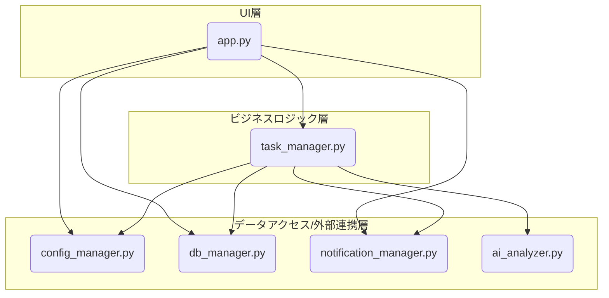

# モジュール設計書 (完成版)

| 項目 | 内容 |
|------|------|
| 文書バージョン | 2.0 (完成版) |
| 作成日 | 2025/07/12 |
| 作成者 | Gemini |

## 1. はじめに

### 1.1. 本書の目的

本書は、「複数PCタスク管理ダッシュボード」を構成する各プログラムモジュール（Pythonファイル）の役割、機能、およびモジュール間の連携方法を定義することを目的とする。開発者は本書に基づき、各モジュールの実装を行う。

### 1.2. 設計方針

- **疎結合・高凝集**: 各モジュールは特定の役割に特化させ（高凝集）、他のモジュールへの依存を極力減らす（疎結合）ことで、保守性・再利用性の高い構造を目指す。
- **階層化**: UI層（ユーザーとのやり取り）、ビジネスロジック層（中核機能）、データアクセス層（外部連携）の3層に分けて考える。

## 2. モジュール構成

本システムは、以下の主要モジュールによって構成される。

| モジュール名 (ファイル名) | レイヤー | 主な役割 |
|---------------------------|----------|----------|
| app.py | UI層 | Streamlitアプリケーションのエントリーポイント。画面レイアウトの定義、ユーザー入力の受付、各機能モジュールの呼び出しを行う。 |
| core/config_manager.py | データアクセス層 | 設定ファイル (config.json) の読み込み、書き込み、検証を行う。 |
| core/db_manager.py | データアクセス層 | ログデータベース (logs.db) への接続、実行結果ログおよび監査ログのCRUDを担当する。 |
| core/task_manager.py | ビジネスロジック層 | pywinrm を使用し、リモートPCのタスクスケジューラを操作する。タスクの取得、作成、編集、削除、実行といった中核ロジックを担う。 |
| core/notification_manager.py | 外部連携層 | Google Chat Webhookへ通知メッセージを送信する。 |
| core/ai_analyzer.py | 外部連携層 | Gemini APIと連携し、エラーログの分析を行う。 |

## 3. モジュール連携図

## 4. 各モジュール詳細

### 4.1. app.py (UI層)

**役割**: Streamlitアプリケーション本体。UIの描画、状態管理、ユーザー入力に応じた他モジュールの呼び出しを行う。

**主要な関数**:

- `render_dashboard()`: ダッシュボード画面を描画。
- `render_logs()`: 実行結果ログ画面を描画。
- `render_reports()`: サマリーレポート画面を描画。
- `render_admin_settings()`: 管理者設定画面を描画。
- `task_detail_dialog()`: タスク編集・削除用ダイアログ。
- `create_task_dialog()`: タスク新規作成用ダイアログ。

### 4.2. core/config_manager.py (データアクセス層)

**役割**: `config.json`ファイルの読み書きを抽象化する。

**主要な関数**:

- `load_config()`: 設定ファイルを読み込む。
- `save_config()`: 設定ファイルを保存する。
- `get_config()`: 全ての設定データを取得する。
- `update_config()`: 設定データ全体を更新する。

### 4.3. core/db_manager.py (データアクセス層)

**役割**: `logs.db` (SQLite) への接続と操作を抽象化する。

**主要な関数**:

- `add_execution_log()`: 実行結果ログを追加する。
- `update_ai_analysis()`: ログにAI分析結果を追記する。
- `search_execution_logs()`: 条件を指定して実行結果ログを検索する。
- `add_audit_log()`: 操作監査ログを追加する。

### 4.4. core/task_manager.py (ビジネスロジック層)

**役割**: リモートPCのタスクスケジューラを操作するコアロジック。

**主要な関数**:

- `get_tasks_from_pc()`: 指定PCからタスク一覧を取得する。
- `create_task()`: 新しいタスクを作成する。
- `update_task()`: 既存タスクを更新する。
- `delete_task()`: タスクを削除する。
- `run_task_now()`: タスクを即時実行する。
- `enable_task()` / `disable_task()`: タスクを有効/無効化する。

### 4.5. core/notification_manager.py (外部連携層)

**役割**: Google Chatへのエラー通知を送信する。

**主要な関数**:

- `send_error_notification()`: エラー情報を受け取り、整形してWebhook URLに送信する。

### 4.6. core/ai_analyzer.py (外部連携層)

**役割**: Gemini APIを利用してエラーログを分析する。

**主要な関数**:

- `analyze_error_log()`: エラーログ情報からプロンプトを生成し、Gemini APIにリクエストを送信、分析結果を返す。